# Cloud Pak for Applications - Tekton Lab

This is a step by step guide to walk you through a quick example of how to create a Tekton pipeline to automate the build, push, and deploy a simple Node.Js application on Openshift. This example uses Buildah as the docker build engine. There are other options for the docker build engine, so it shoudl be noted that this is not the only way to accomplish our task. 

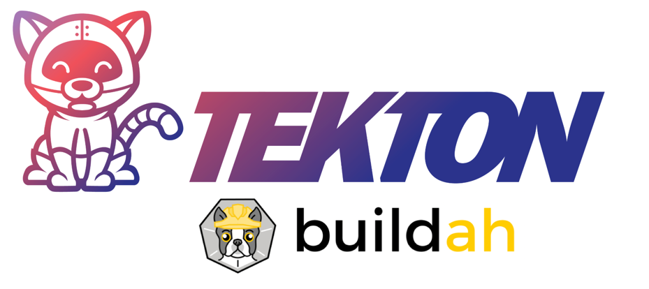

## Here is what you need. 

* **Cloud Pak for Applications deployment**

	*In this example I am using an Openshift environment, which was deployed on IBM Cloud. I then installed the Cloud Pak for Applications from the IBM Cloud catalog. Using IBM Cloud is not a requirement, but you do need to have access to a Cloud Pak for Applications environment.*  

* **GitHub Access Token** ([Here is how you get one](https://help.github.com/en/github/authenticating-to-github/creating-a-personal-access-token-for-the-command-line))
* **Docker Hub Access Token** ([Here is how you get one](https://docs.docker.com/docker-hub/access-tokens/))
* **OpenShift CLI** ([Install Instructions](https://docs.openshift.com/container-platform/3.11/cli_reference/get_started_cli.html#installing-the-cli)) 
* **Pull the contents of this repo down to your local machine**

## What is all this Tekton stuff??

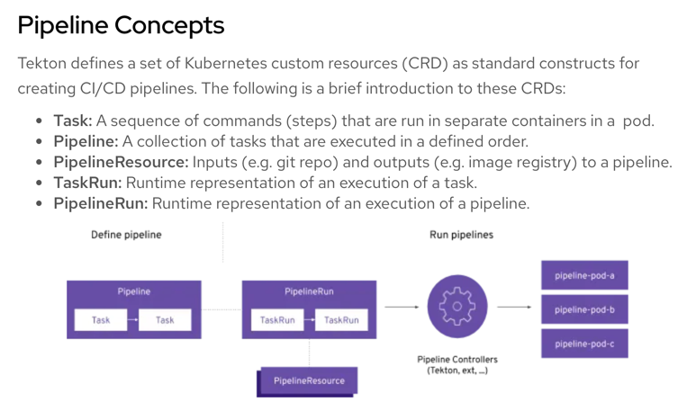

Let me try and explain in a bit more detail what makes up a Tekton Pipeline. As explained above, all objects within a Tekton pipeline are Kubernetes objects. Pipelines have tasks, which are actually a CRD that runs a container. Within the task you define steps, which are commands that you will run inside the container. Pipelines normally have resources accocated with them, which can be accessed by all tasks within that pipeine. It should be noted that tasks can be used within multiple pipelines, so it's good practice to use pipeline resources to define the resources used, such as github repositories or docker hub image definitions. 


## What exactly are we building here??

Here we will deploy a Tekton Pipeline along with Pipeline Resources, and two Task objects. The pipeline will pull our source code from Github and build the Docker image. The image will be pushed to your Docker Hub repository once it is built. Lastly, the pipeline will run the task that deploys this image to your Openshift (Kubernetes) runtime. 

There are a few things you will need to configure along with the pipeline, such as secrets and a service account. We will walk you through all the steps, but you should take some time to learn more about the security roles the are assocated with your service account. I have included a link to some additional information below. 

Here is a diagram of what we are going to build. 

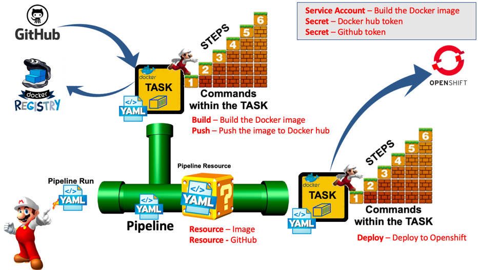

This is how I learned how to setup security roles and running deployments in TASKS. This is not required reading, but I do recommend you review this article. It's got some good tips. 

[https://medium.com/@jerome_tarte/first-pipeline-with-tekton-on-ibm-cloud-pak-for-application-e82ea7b8a6b1](https://medium.com/@jerome_tarte/first-pipeline-with-tekton-on-ibm-cloud-pak-for-application-e82ea7b8a6b1)

--

## Instructions

**1.) Login to your cluster using the OC CLI**

Log into your OpenShift cluster console or application console. In the upper right hand corner you will see an user icon with a drop down menu. From that menu, select the "copy login command" menu item. 

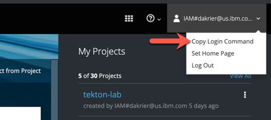

*The login command will look something like this below* **EXAMPLE ONLY**

```
  oc login https://c100-e.us-south.containers.cloud.ibm.com:31111 --token=B0Amf_lcBe21UuYda6-xxXGF0s85x8sxkqxCF1exfbg
```

On your local machine you should now be able to paste that command in a terminal window and issue the login command. 

You can now navigate your terminal window to the directory where you pulled down the contents of this github repository. You will find all the yaml files in the tekton-pipeline sub folder. This is the directory where we are assuming you will run all the following commands from. 

**2.) Create new OpenShift project**

Using the OpenShift CLI you can now issue the command to create a new project. I used the project name "tekton-lab", but you can use any name you want. If you use a differnt name, please check the YAML files and make the necessary changes for the namespace within the files before you apply them. 

```
  oc new-project tekton-lab
```

**3.) Created Secrets for GITHUB and DOCKER using YAML**
Please review the yaml files and make the necessary chagnes. 

Add your username and github personal access token to the stringData section.

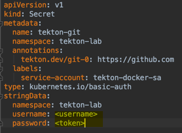

Add your username to the docker registry URL. You will also need to add your username and personal access token in the stringData section. 

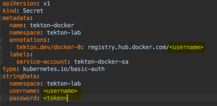

After you make this changes, you will need to deploy these objects to your OpenShift environment. You should apply them to the namecpace of your project. If you used a differnt project name then you will need to make a change to the namespace (which is your project name). 

``` 
  oc apply -f git-sec.yaml
  oc apply -f docker-sec.yaml
```

**IMPORTANT:** Take note of the service account name in the above yaml files. You will next create the service account and the name of your service account MUST match what was used in your secret files above. 


> **NOTE**: Add these files to your .gitignore file, so that you do not add these to the github repository. They now contian sensitive information. 

**4.) Created Service Account using YAML**

Looking at the yaml file for the service account, you can see that we are creating a new service account and we are assocating this new service account with our two secrets (created in the previoius step). 

If you used the same name for the service account and the default names for the secrets, then you should be able to apply this yaml file without any changes. Please make sure you are in the correct project tekton-lab (or your custom project name).

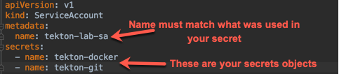

```
   oc apply -f service-account.yaml
```


**5.) Add Privileged access to the Service Account**

We are now going to add privileged access to this service account. You need this because the pipeline will be creating pods when it runs and it needs this authority to create the pods. 

> **NOTE** Please take note that the -n and -z params on this command are in reference to the namespace and service account name. If you used a custom project name then the -n value will be your project name (namespace) and the -z will be your custom name for the service account. 

```
   oc adm policy add-scc-to-user privileged -n tekton-lab -z tekton-lab-sa
```

**6.) Created Resources using YAML**

Edit the tekton pipeline resource files with your account information and create the object in your cluster using the apply command below. 

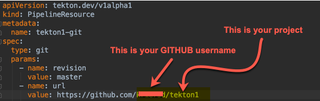

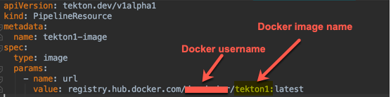

```
  oc apply -f git-resource.yaml

  oc apply -f img-resource.yaml
```

**7.) Create Secret with Login Token**

We need to create a NEW secret with the login token for the tekton-lab-sa service account. We need to use this account for an automated login for the deploy task. We will first run a command to get the token and store it in a file (token.txt). The second command will create a secret using that token. The deploy task will use the token within this secret to login and issue the deploy command. 

If you used a customized project name and/or service account name you will need to modify the command below. 

```
  oc get secret $(oc get secret -n tekton-lab | grep tekton-lab-sa-token | head -1 | awk '{print $1}') -n tekton-lab -o jsonpath="{.data.token}" | base64 -D > token.txt
```

```
  oc create secret generic tekton-lab-deployer-secret --from-literal=user=sa --from-file=token=token.txt -n tekton-lab
```
> **NOTE:** Add this token.txt file to the .gitignore file before you push this to the git repo. 


**8.) Adding Role to allow for deployments**

We need to add the tekton-lab-sa service account to the EDIT role, so that it has the proper authorty to make the deployment. This happens within the deployment task during the pipeline execution. 

> **NOTE:** If you used a customized project name and/or service account name you will need to modify the command below. 

```
  oc adm policy add-role-to-user edit -n tekton-lab -z tekton-lab-sa
```


**9.) Created Task using YAML**
Review the task.yaml file before running the command. If you used the default names for the project and the service account you won't need to make any changes. 

```
  oc apply -f task.yaml
```

**10.) Create the deployment yaml in the tekton-pipeline dir**

This command will create the deployment.yaml file, which is used during the deployment task. Make sure you run this command within the tekton-pipeline sub folder. 

**NOTE:** Please make sure you modify the command and put your own username in the command. 

**NOTE:** You may already have this file in your directory. If so, you can delete it before running the command. 

```
  oc create deployment tekton1 --image=<<docker username> /tekton1:latest --dry-run -o yaml > deployment.yaml
```

**11.) Create the oc-deployment task using YAML**

This command will create the deployment task. You can review the file before you run it, but you shouldn't have to change anything unless you used a customized project name and/or service account. 

```
  oc apply -f oc-deploy.yaml
```


**12.) Created Pipeline using YAML**

This command will create the Tekton pipeline. Again, you can review the file before you run it, but you shouldn't have to change anything unless you used a customized project name and/or service account. 

```
  oc apply -f pipeline.yaml
```


**13.) Run the pipeline**

You are now ready to run the pipeline. You can apply this YAML file to invoke the pipeline. Each time you run the pipeline you will need to make sure the name is unique. 

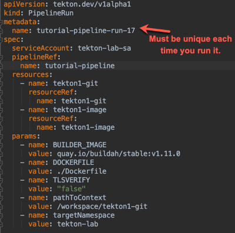

```
  oc apply -f pipeline-run.yaml
```

You should now see the Tekton Pipeline running in the GUI. Green is good!!
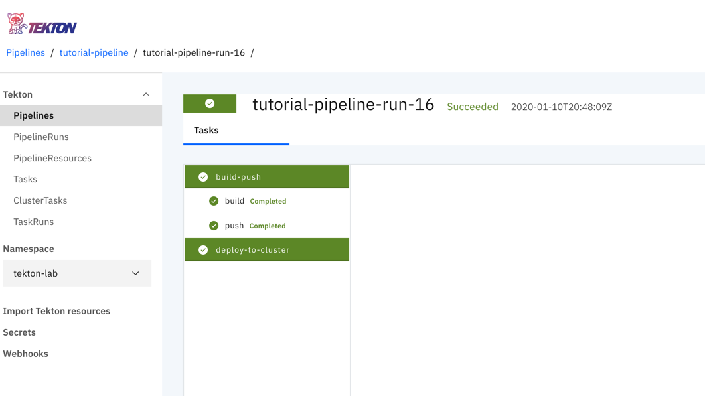

-

> **NOTE:**  *Tekton Pipelines 0.6+ support also the $() syntax for variable substitution. Older implementations of Tekton will use the $[...variable...} format. 
> NEWER v0.6+ of Tekton will use the $(...variable...) format*

> More information on the variable formats can be found here. 

> [https://github.com/tektoncd/pipeline/issues/850](https://github.com/tektoncd/pipeline/issues/850)
  
> **NOTE:**  *Be carful not to commit any sensitive information such as tokens, userid's or password's to the GitHub repository. You can create a .gitignore file and list out the files that contain your sensitive information.*
> 
> If you find yourself in a situation where you have comitted somthing sensitive, you will need to follow the instructions below to remove the history of your repository. 
> 
> **How to rebase your master in GIT - In case you added files you didn't want to add and it's it the history.**

> [https://tecadmin.net/delete-commit-history-in-github/](https://tecadmin.net/delete-commit-history-in-github/)

**Common Problems**

* Ran into errors with the BUILD (within Buildah on the tekton pipeline) - The Build Step seems to hit a permission problem. Below is the error message I see in the Tekton Pipleline logs for the build step. 

	**STEP 5: COPY**. *.error building at STEP "COPY . .": error copying "/workspace/tekton1-git" to "/var/lib/containers/storage/overlay/c495ced1e80c26b3dab3467b01326807dc457f16f5f3aa8a1fa21a220ae9c8ac/merged/usr/src/app": Error processing tar file(exit status 1): permission denied*
	
	To resolve this, I had to add the node_modules directory to the .gitignore file. There seems to be a tar file in that directory that the Buildah builder can't handle. 


